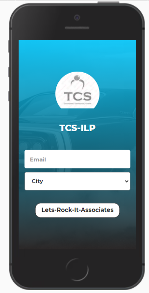
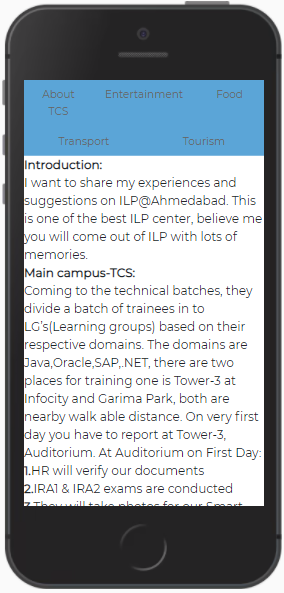
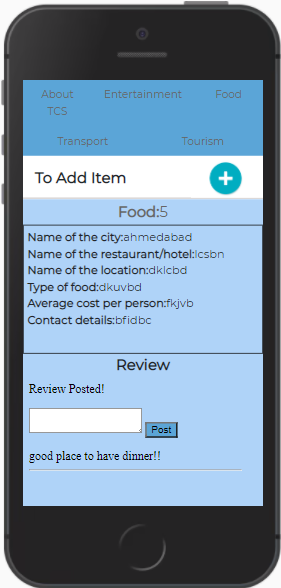

# Review_Website_Mobileversion
Designed and developed review website for trainning employes in TCS. 

# Problem Statement
India is a diverse nation with differences in culture, language, food, and so on. this makes the life of trainees difficult because they have to migrate to various training centers located in various cities. On migration to new cities, most employees finding it difficult to adapt to local food, culture, and language.
To solve this issue, I developed a mobile-based web application based on certain parameters targetting the employees of the organization.

# Parameters taken into account
1. Basic information about the accomodation facility provided.
2. Native food based restaurants location and its review.
3. Entertainment place location and its review.
4. Types of transport facility available and its review.
5. Tourist place to be visited and its review.

# Mobile version
1. Login screen
For login we make use of organization mail id.

2. Basic information screen

3. Review page [For Food, Entertainment, Tourism, and Transport]

4. To add new item to the corresponding category.

# Conclusion
This mobile-based web application developed was very much useful for all the trainees to know more about the culture, food and other entertainment-related information directly from the previous trainee who completed their training from that particular city.  
